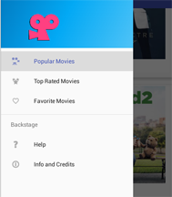
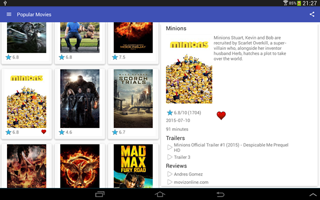
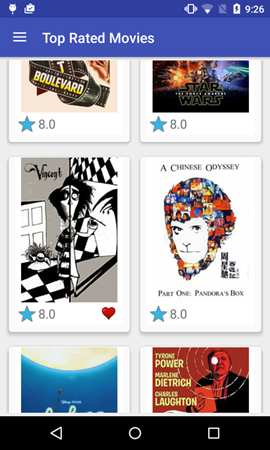
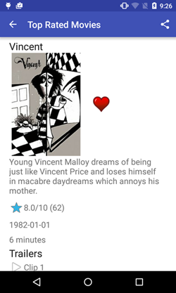
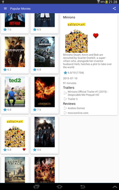

# Popular Movies Android Application

## Play store - downloadable test app - try it here:

https://play.google.com/store/apps/details?id=com.jimandreas.popularmovies

## Current status / updates:  :movie_camera:

 * Switched from GridLayout to Constraints on movie detail activity
 * Reworked code to use annotations for app state instead of strings (much cleaner)
 * Added release key generation (see below)

## History

This application was submitted by Jim Andreas as the final project to compete the requirements of the Udacity course:

**Developing Android Apps - Android Fundamentals**

https://www.udacity.com/course/developing-android-apps--ud853

## Building this application with Android Studio - prerequisite

<b>You will need an API key from TheMovieDB.org.  For this app, add your key to your grade.properties file:</b>

    /Users/Myname/.gradle/gradle.properties

with this identifier (edit in your key between the quotes):

     TheMovieDbApiToken="12341234123412341234"

<b>For a release build, you need to add a `signing.properties` file to the gradle folder. See this guide: http://gist.github.com/gabrielemariotti/6856974</b>

## Design comments - UX and Architecture

The menu is implemented in a [Navigation Drawer](https://www.google.com/design/spec/patterns/navigation-drawer.html):

As you can see it provides the required controls to select among "Popular", "Top Rated", or "Favorite" movies.
It uses the familiar sliding action with a swipe or touch of the drawer icon at the top left of the layout.

### Architecture

The architecture of the project borrows chiefly from the Sunshine project in the Udacity course.  It implements a Content Provider
to manage an SQLite database.  An AsyncTask class fetches the JSON data from TheMovieDB and parses it in much the same 
manner as Sunshine.

A RecyclerView is implemented to display the movie thumbnails, rating and favorite status.   The detail view was painfully 
implemented using the GridLayout class for various sizes and orientations of devices.   The detail view has since been reworked
using the Constraint system available in Android Studio 2.2.

A singleton class, the TrafficManager, was developed to hold application state information across the app lifecycle 
for presentation continuity and download page management.  This helped to make for a more seamless user experience as there
was no restriction on a "page view" presentation of the movie information.

The RecyclerView implementation borrows heavily from the Material Design section in the Udacity Advanced Android App course:

https://www.udacity.com/course/advanced-android-app-development--ud855

## Application screenshot
Just the tablet landscape screenshot for now.   If you scroll to end of this Markdown document, then you can see other screenshots in the appendix.

## Criteria

The app design checks off the following requirements that were demanded by the Udacity class project:

**User Interface - Layout**

- [X] Movies are displayed in the main layout via a grid of their corresponding movie poster thumbnails
- [X] UI contains an element (e.g., a spinner or settings menu) to toggle the sort order of the movies by: **most popular, highest rated, and favorites**
- [X] UI contains a screen for displaying the details for a selected movie
- [X] Movie Details layout contains title, release date, movie poster, vote average, and plot synopsis.
- [X] Movie Details layout contains a section for displaying trailer videos and user reviews
- [X] Tablet UI uses a Master-Detail layout implemented using fragments. The left fragment is for discovering movies. The right fragment displays the movie details view for the currently selected movie.

**User Interface - Function**
- [X] When a user changes the sort criteria (**most popular, highest rated, and favorites**) the main view gets updated correctly.
- [X] When a movie poster thumbnail is selected, the movie details screen is launched [Phone] or displayed in a fragment [Tablet]
- [X] When a trailer is selected, app uses an Intent to launch the trailer
- [X] In the movies detail screen, a user can tap a button(for example, a star) to mark it as a Favorite

**Network API Implementation**
- [X] In a background thread, app queries the /discover/movies API with the query parameter for the sort criteria specified in the settings menu. (Note: Each sorting criteria is a different API call.)
- [X] This query can also be used to fetch the related metadata needed for the detail view.
- [X] App requests for related videos for a selected movie via the /movie/{id}/videos endpoint in a background thread and displays those details when the user selects a movie.
- [X] App requests for user reviews for a selected movie via the /movie/{id}/reviews endpoint in a background thread and displays those details when the user selects a movie.

**Data Persistence**
- [X] App saves a **Favorited** movie to SharedPreferences or a database using the movies'  id.
- [X] When the **favorites** setting option is selected, the main view displays the entire favorites collection based on movie IDs stored in SharedPreferences or a database.

**General Project Guidelines**
- [X] App conforms to common standards found in the Android Nanodegree General Project Guidelines 

#### Extended Criteria

**ContentProvider**
- [X] App persists favorite movie details using a database
- [X] App displays favorite movie details even when offline
- [X] App uses a ContentProvider to populate favorite movie details

**Sharing Functionality**
- [X] Movie Details View includes an Action Bar item that allows the user to share the first trailer video URL from the list of trailers
- [X] App uses a share Intent to expose the external youtube URL for the trailer

#### Core App Quality Quidelines

The Application was designed with the requirements listed at the link below in mind.

http://udacity.github.io/android-nanodegree-guidelines/core.html

### License and Disclaimers

Portions of this page are modifications based on work created and
shared by Google and used according to terms described in the Creative Commons 3.0 Attribution License.
See also the LICENSE.txt file at the top level of the repo.

** and **

Copyright (C) 2015 The Android Open Source Project

Licensed under the Apache License, Version 2.0 (the "License");
you may not use this file except in compliance with the License.
You may obtain a copy of the License at

     http://www.apache.org/licenses/LICENSE-2.0

Unless required by applicable law or agreed to in writing, software
distributed under the License is distributed on an "AS IS" BASIS,
WITHOUT WARRANTIES OR CONDITIONS OF ANY KIND, either express or implied.
See the License for the specific language governing permissions and
limitations under the License.

# About / Attribution

## TheMovieDB

This Android Application downloads movie information from TheMovieDB.org.   Per the terms, the website 
requires posting this notice:

> Logos & Attribution
>- As per our terms of use, every application that uses our data or images is required to properly attribute TMDb as the source. Below you will find some logos you can use within your application.

## Icons

Icons used in this App were kindly provided by the Material Design team at Google.  They can be found at the following links:

https://www.google.com/design/spec/style/icons.html

https://github.com/google/material-design-icons/

## Picasso library

The truly excellent Picasso library took all the work out of downloading, caching, and inserting graphics from TheMovieDB into Views in the App.
A big "Thank You!" to the good folks at Square for their work.   Here is the web page link or just search for "Picasso" on GitHub:

http://square.github.io/picasso/

# Appendix - App Screenshots

## Phone Portrait

## Phone Portrait - showing movie details

## Tablet in portrait orientation

